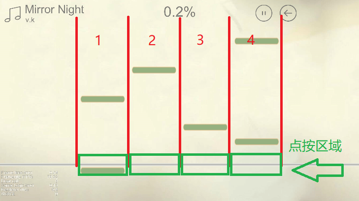

# 综合实验——微信小游戏 PianoWizard 文档

---

#### 姓名: [司徒轩](https://github.com/myosotisx) [沈翘楚](https://github.com/QQQQQH)
#### 学号: 2017011449 2017011476
#### 班级: 软件73 72
#### 邮箱: shenqc1999@qq.com
#### 时间: 2019.07.18
#### 项目地址: [https://github.com/QQQQQH/PianoWizard](https://github.com/QQQQQH/PianoWizard)

---

## 游戏简介与玩法说明
PianoWizard是一款以钢琴演奏为主题的休闲音乐小游戏，考验玩家的操作的灵活性，可以帮助玩家锻炼协调能力。游戏的核心玩法很简单，玩家根据音乐的节奏，在参考线上击中下落的琴键即可得分。具体玩法如下：玩家进入游戏后可以选择曲目，目前添加的两首曲子难度系数不同（*Powder Snow*对新手相对友好），点击曲目的封面进入游戏主界面如下所示

红色标记的为四条琴键下落的轨道，绿色方框为点按的区域，琴键落到灰色参考线时刻为音乐的节奏点，玩家此时需要通过点按落到绿色区域中的琴键来得分。点按后会有击中判定特效，方框特效表示*Perfect*,圆点特效表示*Good*。游戏中会统计并显示玩家的连击(Combo)次数，踩准节奏点，连击次数多即可得高分！

---

## 团队分工
司徒轩负责游戏开场界面，乐谱选择界面，游戏界面和结束界面的设计制作与相关操作逻辑的脚本编写。沈翘楚负责游戏内部组件的制作与相关游戏逻辑的脚本编写。

另外，游戏中共有两首曲子，二人分别负责了其中一首的曲谱的设计与编写。

---

## 开发过程
设计阶段，团队成员先对主要游戏逻辑实现的具体方法进行了构思，并确定各自负责的区域需要提供哪些接口，进行了合理的任务分配。

开发阶段，采用递归开发的方式，先完成了游戏主场景的搭建，实现游戏的核心玩法。然后添加游戏特效，制作游戏的开始、选择和结算场景，并向游戏中添加判定和计分机制。最后优化游戏素材（添加音效，更换更加美观清晰的图像素材等）。

## 游戏逻辑
考虑到音乐游戏未来维护中可能添加更多曲目，所以采用动态加载的方式加载放置在resource文件夹下的曲谱、封面和音乐资源。曲谱采用json文件存储，用数组记录了音乐节奏点对应的时间，游戏读取曲谱后可以根据数组内容在某一时间点生成游戏中的琴键。

在游戏进行界面中，在游戏场景的组件下，共有4个轨道类型的子组件。游戏开始后，开始播放音乐，并向4个轨道子组件传入曲谱数据。轨道组件内部更新计时器，在传入的曲谱标记的位置在轨道的顶端添加琴键。琴键自动开始向下的运动。轨道监测底部是否有触摸事件，如果有触摸事件发生，则根据当前轨道最下方的琴键与底部横线的距离，计算出相应得分，销毁相应琴键，并根据得分不同在原琴键位置添加不同的粒子效果，并将得分情况反馈给父级组件以计算总分数与连击情况。

---

## 遇到的问题与困难
由于是二人都是第一次使用Github进行团队协作，在不断摸索中，犯了不少错误。一直到开发进行到接近一半为止，在Git的版本管理上都遇到了许多棘手的问题，有几次因为文件更改冲突，再加上操作的失误，导致版本库十分混乱。甚至先后删除并重建过两次仓库。现有的Github上的仓库，实际上已经是第三次建立了，这个仓库的初次Commit，实际以及是一个实现了游戏基本功能的相对完成的版本了。好在之后逐渐熟悉了相关的逻辑与操作，便没有再在这方面遇到更多的麻烦。
